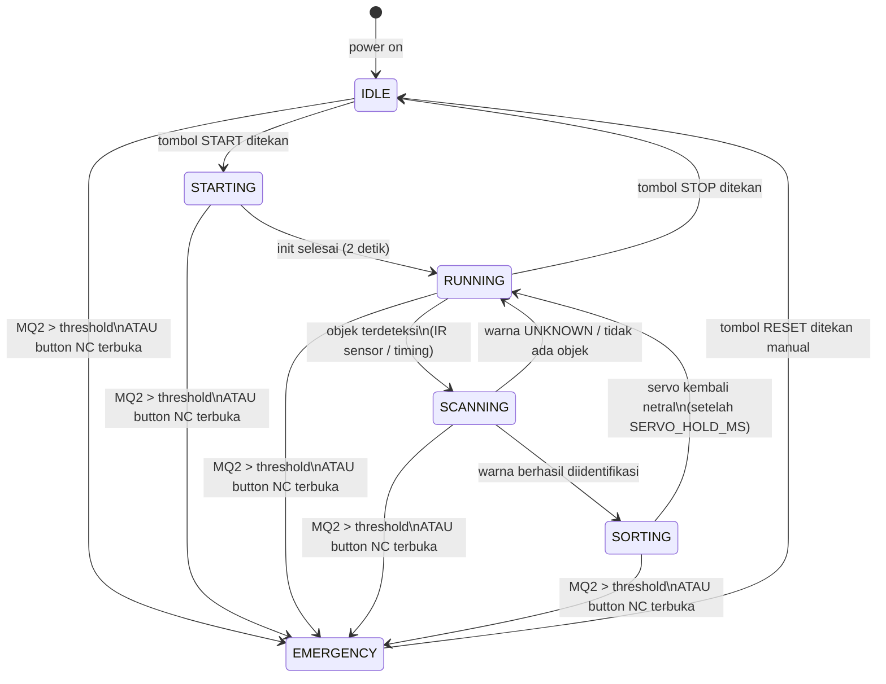

# State Machine — Sistem Pemilah Warna

> Dokumen ini adalah **anchor utama** semua keputusan coding.
> Jika ada ambiguitas logika, rujuk ke sini dulu.
> Update dokumen ini setiap kali ada perubahan state atau transisi.

---

## Daftar State

| State | Deskripsi | LED Indikator |
|-------|-----------|---------------|
| `IDLE` | Sistem standby, tunggu tombol START | Kuning |
| `STARTING` | Init: servo netral, konveyor mulai, warm-up | Kuning kedip |
| `RUNNING` | Konveyor jalan, tunggu objek masuk zona scan | Hijau |
| `SCANNING` | Objek terdeteksi, sensor sedang baca warna | Hijau kedip |
| `SORTING` | Servo aktif memilah berdasarkan warna | Hijau kedip |
| `EMERGENCY` | Darurat aktif — semua aktuator mati | Merah + buzzer |

---

## Diagram State Machine



---

## Tabel Transisi Lengkap

| Dari State | Event / Trigger | Ke State | Aksi saat transisi |
|------------|-----------------|----------|--------------------|
| `IDLE` | Tombol START ditekan | `STARTING` | Init servo netral, mulai konveyor pelan |
| `STARTING` | Timer 2000ms elapsed | `RUNNING` | Konveyor full speed, LCD update |
| `RUNNING` | Objek terdeteksi di zona scan | `SCANNING` | Konveyor slow/stop, mulai baca sensor |
| `SCANNING` | Warna berhasil diidentifikasi | `SORTING` | Catat warna, hitung timing servo |
| `SCANNING` | Warna UNKNOWN atau noise | `RUNNING` | Log UNKNOWN, lanjut |
| `SORTING` | SERVO_HOLD_MS elapsed | `RUNNING` | Servo netral, counter++ |
| `RUNNING` | Tombol STOP ditekan | `IDLE` | Konveyor stop, servo netral |
| `ANY` | MQ2 ADC > GAS_THRESHOLD | `EMERGENCY` | Relay OFF, motor stop, servo netral, buzzer ON |
| `ANY` | Button NC terbuka (ditekan) | `EMERGENCY` | Sama seperti di atas |
| `ANY` | Relay feedback LOW (aktuator mati tiba-tiba) | `EMERGENCY` | Log, tampilkan di LCD |
| `EMERGENCY` | Tombol RESET ditekan manual | `IDLE` | Relay ON, buzzer OFF, LCD reset |

---

## Aturan Emergency (Prioritas Tertinggi)

Emergency bisa trigger dari state manapun dan kapan saja.
Implementasi di kode: cek emergency di awal setiap iterasi `loop()`, sebelum switch-case state.

```
Setiap loop():
  1. cek MQ2 ADC → jika > threshold → EMERGENCY
  2. cek relay feedback GPIO → jika LOW (aktuator mati tiba2) → EMERGENCY  
  3. cek button NC → jika terbuka → EMERGENCY
  4. baru masuk switch-case state machine
```

---

## Perilaku Tiap State (Detail)

### IDLE
- Konveyor: STOP
- Servo: posisi netral (90°)
- Relay: ON (aktuator siap, tapi motor stop)
- LCD: `IDLE / Tekan START`
- Polling: MQ2 tetap dimonitor

### STARTING
- Konveyor: mulai pelan (PWM ramp-up)
- Servo: set ke posisi netral
- LCD: `Starting...`
- Timer: 2000ms lalu transisi ke RUNNING

### RUNNING
- Konveyor: full speed (MOTOR_SPEED_DEFAULT)
- Servo: netral
- Polling: tunggu trigger objek (IR break-beam atau timer)
- LCD: `RUNNING / [warna terakhir]`

### SCANNING
- Konveyor: slow atau stop (opsional, tergantung desain)
- Urutan baca sensor:
  1. Matikan semua LED
  2. Baca ambient ADC → simpan
  3. LED R ON → baca ADC → kompensasi → simpan
  4. LED G ON → baca ADC → kompensasi → simpan
  5. LED B ON → baca ADC → kompensasi → simpan
  6. Normalisasi: `r_norm = R / (R+G+B)`, dst
  7. Nearest neighbor vs database
  8. Return ColorID
- LCD: `SCANNING...`

### SORTING
- Servo aktif sesuai warna terdeteksi
- Timer: tahan SERVO_HOLD_MS
- Counter increment
- MQTT publish color + count
- LCD: `Sorting: [WARNA]`

### EMERGENCY
- Relay: OFF (aktuator mati total via hardware)
- Motor: STOP (software + hardware)
- Servo: netral (tidak bisa bergerak karena relay OFF)
- Buzzer: ON, pola alert
- LED: Merah ON, hijau/kuning OFF
- LCD: `!! EMERGENCY !!` + penyebab
- MQTT: publish emergency event
- Loop: hanya polling tombol RESET, MQ2, dan relay feedback