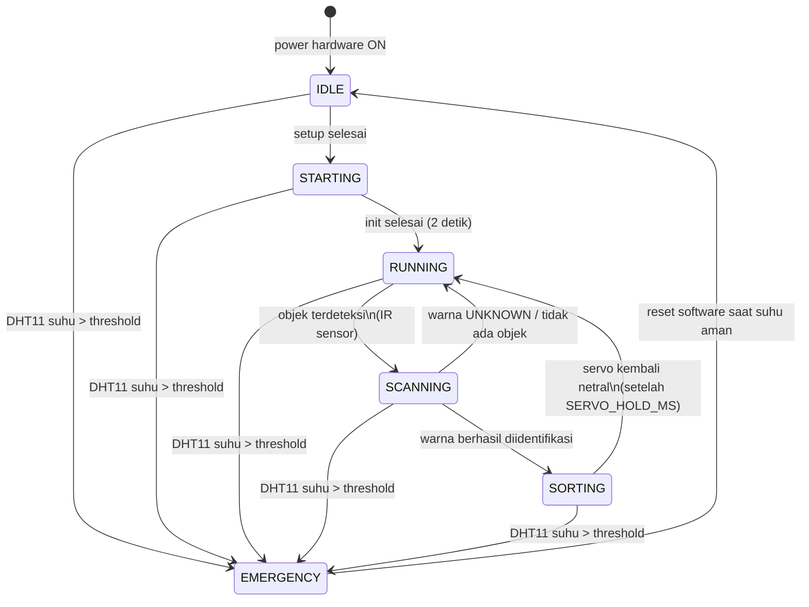

# State Machine - Sistem Pemilah Warna

> Dokumen ini adalah anchor utama keputusan coding.
> Jika ada ambiguitas logika, rujuk ke sini dulu.
> Update dokumen ini setiap kali ada perubahan state atau transisi.

---

## Catatan Revisi Hardware

- Tombol START dan STOP tidak diproses kode. Keduanya langsung terhubung ke power supply untuk menyalakan dan mematikan sistem keseluruhan.
- Emergency button NC latched tidak diproses kode. Tombol ini dipasang seri dengan jalur relay sebagai saklar manual emergency.
- Emergency otomatis dari firmware memakai threshold DHT11.

---

## Daftar State

| State | Deskripsi | Output Utama |
|-------|-----------|--------------|
| `IDLE` | Sistem standby setelah power hardware ON | Relay siap, motor stop |
| `STARTING` | Init: servo netral, konveyor mulai, warm-up | Motor ramp-up |
| `RUNNING` | Konveyor jalan, tunggu objek masuk zona scan | Motor jalan |
| `SCANNING` | Objek terdeteksi, sensor sedang baca warna | LED RGB sensor aktif bergantian |
| `SORTING` | Servo aktif memilah berdasarkan warna | Servo bergerak sesuai warna |
| `EMERGENCY` | Darurat otomatis aktif dari DHT11 | Relay OFF, aktuator mati |

---

## Diagram State Machine



---

## Tabel Transisi Lengkap

| Dari State | Event / Trigger | Ke State | Aksi saat transisi |
|------------|-----------------|----------|--------------------|
| `IDLE` | Sistem mendapat power dari tombol hardware | `STARTING` | Init servo netral, mulai konveyor pelan |
| `STARTING` | Timer 2000 ms elapsed | `RUNNING` | Konveyor full speed, LCD update |
| `RUNNING` | Objek terdeteksi di zona scan | `SCANNING` | Baca sensor warna |
| `SCANNING` | Warna berhasil diidentifikasi | `SORTING` | Catat warna, hitung timing servo |
| `SCANNING` | Warna UNKNOWN atau noise | `RUNNING` | Log UNKNOWN, lanjut |
| `SORTING` | `SERVO_HOLD_MS` elapsed | `RUNNING` | Servo netral, counter++ |
| `ANY` | DHT11 suhu > threshold | `EMERGENCY` | Relay OFF, motor stop, servo netral |
| `EMERGENCY` | Reset software dan suhu sudah aman | `IDLE` | Relay ON, LCD reset |

Tombol STOP hardware memutus power sistem, sehingga tidak ada transisi software khusus untuk STOP.

---

## Aturan Emergency Otomatis

Emergency otomatis bisa trigger dari state manapun dan kapan saja.
Implementasi di kode: cek DHT11 di awal setiap iterasi `loop()`, sebelum switch-case state.

```text
Setiap loop():
  1. baca DHT11 sesuai interval
  2. jika pembacaan gagal -> EMERGENCY_SENSOR
  3. jika suhu >= threshold -> EMERGENCY_TEMP
  4. jika aman -> lanjut state machine utama
```

Emergency manual dari NC latched button bekerja secara hardware dengan memutus jalur relay, bukan melalui `digitalRead()`.

---

## Perilaku Tiap State

### IDLE
- Konveyor: STOP
- Servo: posisi netral 90 derajat
- Relay: ON jika suhu aman
- LCD: `IDLE / Standby`
- Polling: DHT11 tetap dimonitor

### STARTING
- Konveyor: mulai pelan atau sesuai implementasi
- Servo: set ke posisi netral
- LCD: `Starting...`
- Timer: 2000 ms lalu transisi ke RUNNING

### RUNNING
- Konveyor: full speed
- Servo: netral
- Polling: tunggu trigger objek dari IR sensor
- LCD: `RUNNING / [warna terakhir]`

### SCANNING
- Urutan baca sensor:
  1. Matikan semua LED
  2. Baca ambient ADC dari LDR
  3. LED R ON, baca ADC, kompensasi
  4. LED G ON, baca ADC, kompensasi
  5. LED B ON, baca ADC, kompensasi
  6. Normalisasi: `r_norm = R / (R+G+B)`, dst
  7. Nearest neighbor vs database
  8. Return ColorID
- LCD: `SCANNING...`

### SORTING
- Servo aktif sesuai warna terdeteksi
- Timer: tahan `SERVO_HOLD_MS`
- Counter increment
- MQTT publish color + count jika modul IoT aktif
- LCD: `Sorting: [WARNA]`

### EMERGENCY
- Relay: OFF
- Motor: STOP
- Servo: netral secara software, lalu aktuator mati karena relay OFF
- LCD: `!! EMERGENCY !!` + penyebab otomatis
- MQTT: publish emergency event jika modul IoT aktif
- Loop: hanya reset jika kondisi DHT11 sudah aman
