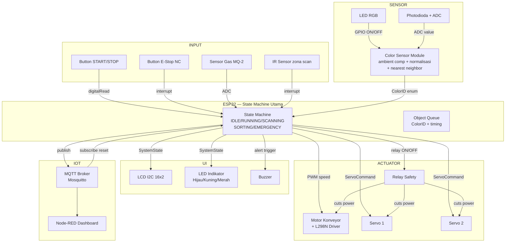
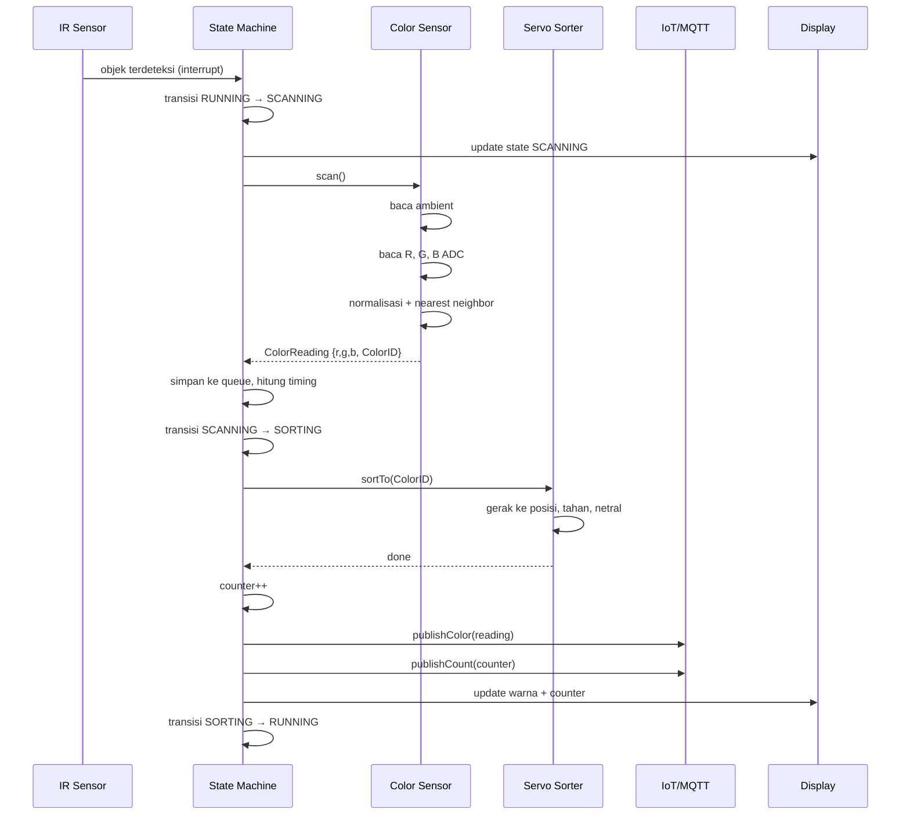

# System Flow & Interface Contract Antar Subsistem

> Dokumen ini menjawab: subsistem A menghasilkan data apa, formatnya bagaimana,
> dan siapa yang mengkonsumsinya.
> Ini yang memungkinkan tiap orang coding bagiannya secara independen.

---

## Block Diagram Sistem



---

## Data Flow Detail



---

## Interface Contract Per Modul

### Color Sensor → State Machine

```c
// Output dari color_sensor.h
typedef enum {
    COLOR_UNKNOWN    = 0,
    COLOR_RED        = 1,
    COLOR_GREEN      = 2,
    COLOR_BLUE       = 3,
    COLOR_WHITE      = 4,
    COLOR_BLACK      = 5,
    COLOR_NO_OBJECT  = 6
} ColorID;

typedef struct {
    uint16_t adc_r;       // raw ADC setelah kompensasi ambient
    uint16_t adc_g;
    uint16_t adc_b;
    float    r_norm;      // r / (r+g+b)
    float    g_norm;
    float    b_norm;
    float    nn_distance; // jarak ke database terdekat
    ColorID  color;
    const char* colorName;
} ColorReading;

// Fungsi yang dipanggil state machine:
ColorReading colorSensor_scan(void);
bool         colorSensor_objectPresent(void);
```

### State Machine → Servo Sorter

```c
// Input ke servo_sorter.h
void servoSorter_sortTo(ColorID color);
// Internally maps:
//   COLOR_RED   → servo1: 30°,  servo2: 90°
//   COLOR_GREEN → servo1: 150°, servo2: 90°
//   COLOR_BLUE  → servo1: 90°,  servo2: 30°
//   default     → servo1: 90°,  servo2: 90° (netral)
void servoSorter_setNeutral(void);
```

### State Machine → IoT

```c
// Data yang dipublish ke MQTT:
void iot_publishState(SystemState state);
void iot_publishColor(ColorReading* reading);
void iot_publishGas(uint16_t adc);
void iot_publishCount(uint32_t r, uint32_t g, uint32_t b, uint32_t total);
void iot_publishEmergency(const char* trigger, uint16_t value);
```

### Emergency → State Machine (feedback)

```c
// Emergency module mendeteksi dan SET FLAG — state machine baca flag ini
typedef struct {
    bool gasTriggered;
    bool buttonTriggered;
    bool relayFeedbackLost;
    uint16_t gasADC;
} EmergencyStatus;

EmergencyStatus emergency_getStatus(void);
void            emergency_clearFlags(void);   // hanya dipanggil saat reset
```