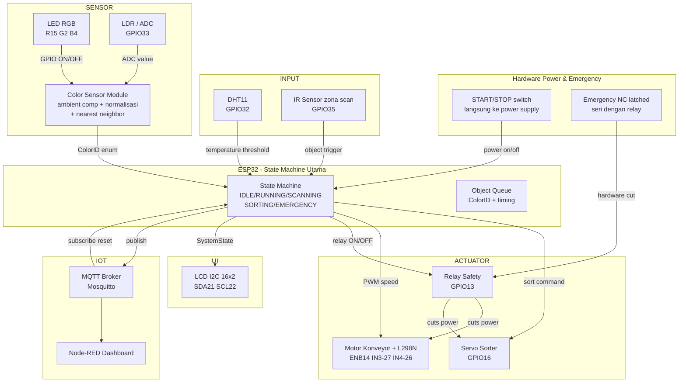
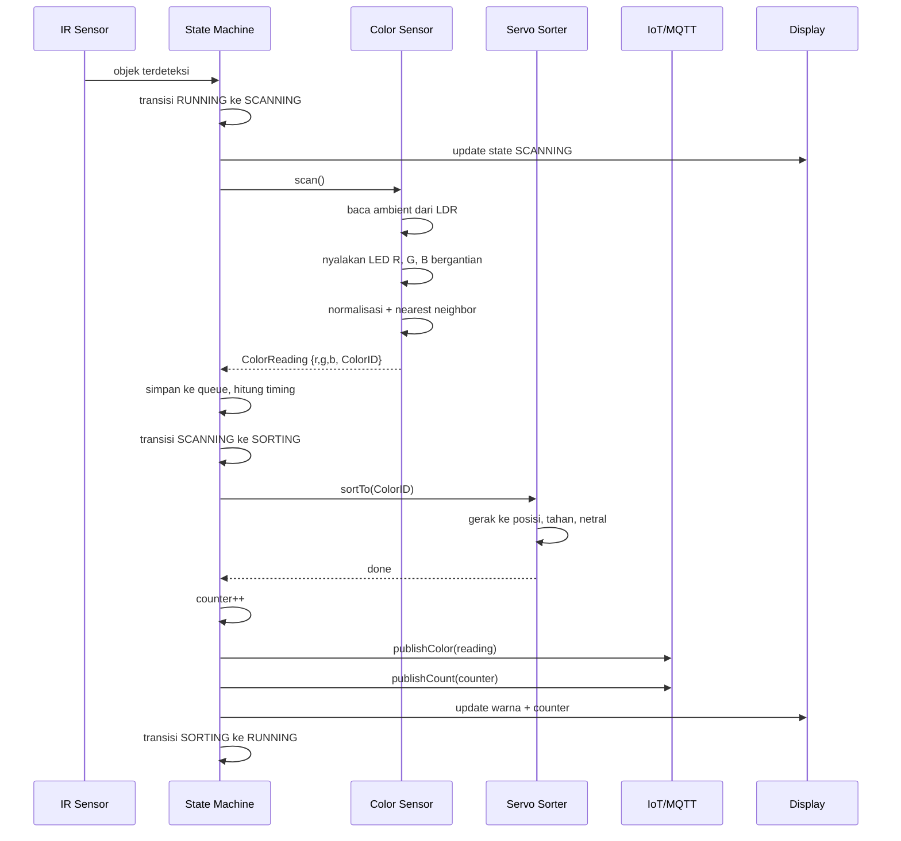

# System Flow & Interface Contract Antar Subsistem

> Dokumen ini menjelaskan data antar subsistem supaya tiap modul bisa dikembangkan mandiri.

---

## Block Diagram Sistem



---

## Data Flow Detail



---

## Interface Contract Per Modul

### Color Sensor ke State Machine

```c
typedef enum {
    COLOR_UNKNOWN    = 0,
    COLOR_RED        = 1,
    COLOR_GREEN      = 2,
    COLOR_BLUE       = 3,
    COLOR_WHITE      = 4,
    COLOR_BLACK      = 5,
    COLOR_NO_OBJECT  = 6
} ColorID;

typedef struct {
    uint16_t adc_r;
    uint16_t adc_g;
    uint16_t adc_b;
    float    r_norm;
    float    g_norm;
    float    b_norm;
    float    nn_distance;
    ColorID  color;
    const char* colorName;
} ColorReading;

ColorReading colorSensor_scan(void);
bool         colorSensor_objectPresent(void);
```

### State Machine ke Servo Sorter

```c
void servoSorter_sortTo(ColorID color);
void servoSorter_setNeutral(void);
```

### State Machine ke IoT

```c
void iot_publishState(SystemState state);
void iot_publishColor(ColorReading* reading);
void iot_publishTemperature(float temperatureC);
void iot_publishCount(uint32_t r, uint32_t g, uint32_t b, uint32_t total);
void iot_publishEmergency(const char* trigger, float value);
```

### Emergency ke State Machine

```c
typedef struct {
    bool temperatureTriggered;
    bool sensorError;
    float temperatureC;
} EmergencyStatus;

EmergencyStatus emergency_getStatus(void);
void            emergency_clearFlags(void);
```
